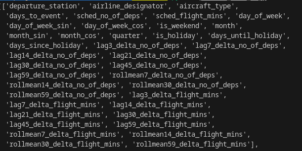
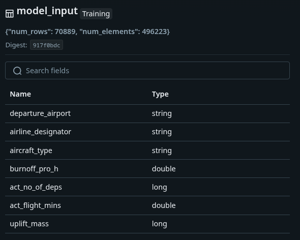

### Goal: More efficient fuel Uplift forecast

Staus Quo: The current tool assigns the average uplift from the last three full calendar months for the city pair and aircraft type to each event in the schedule and sums everything up.

<!--  -->
<!--  -->

---

assumptions
problems

--- 

### Schedule behavior analysis

<iframe scrolling="no" style="border:none;" seamless="seamless" data-src="assets/weeks_to_event_analysis_by_airline_designator.html" height="450" width="100%"></iframe>

---

### Our Idea Model 1

::: incremental

- Scheduled and actual flights are rarely the same
- Model difference between scheduled and actual flights
- Features used:
- Aircraft type, Airport, Airline 
- Time based trends and seasonal features
- Days from current schedule until flight
- Forecast: Number of departures, Number of minutes flown
- Take these values and feed them to a second model

:::

---

### Model 1 input features

---

### Our Idea Model 2

::: incremental

- Use output of model 1 as input to predict total burnoff
- Instead of using avg try other ML based models 
- Compare the results to status quo as well as actual burnoff

:::

---

### Model 2 input features

---

### Assumptions

1. Using a seasonal avg of mins flown will be better than the scheduled min
2. Minutes flown and total departures is a good indicator of fuel burnoff 
3. Due to scheduling flux modeling schedule changes will lead to more accurate forecasts

---

### Model Flow Chart

---

### General Results Model 1

<iframe scrolling="no" style="border:none;" seamless="seamless" data-src="assets/absolute_error_quantiles.html" height="450" width="100%"></iframe>

---

### General Results Model 2

<iframe scrolling="no" style="border:none;" seamless="seamless" data-src="assets/absolute_error_quantiles.html" height="450" width="100%"></iframe>

---

### Case 1 results

---

### Case 2 results

---

### Case 3 results

---

### Case dtacs results

---

### HOw does our model compare to yours?

    The answer: to improve transparency and coordination

    Before departure:
    🛫 Fueling must be done
    🧳 Baggage loading must be finished
    🍽 Catering must be finished
    👨‍✈️ Crew needs a clear status

    Simple monitoring → Smoother operations → Fewer delays

    

---

### Improvements to our model that will make it even better

- 🧱 PostgreSQL – Raw flight & fueling data
- 🔁 Rahla – Event-driven data processing
- 🧠 SciKit Learn – model
- 🧪 MLflow – Model versioning / Serving
- ☸️ Kubernetes – Deployment platform
- 🔁 ArgoCD – Orchestration
- 🛠️ Theia – Continual development environment

---

### Some dT Projects in the airline industry

{ width=200px align=right }

- 🔁 Fuel Emission Forecasting 
- 👥 Passenger Flow  
- 🛰️ Flight Positioning 
- ⛽ Fueling Duration 
- 💳 Fuel Purchase Forecasting

--- 

### Links

- [My Github](https://github.com/samueladamsmcguire)
- [datatactics website](https://www.datatactics.de/)
- [datatactics LinkedIn](https://www.linkedin.com/company/datatactics-gmbh)

---

### Let's connect

{ width=60% }

