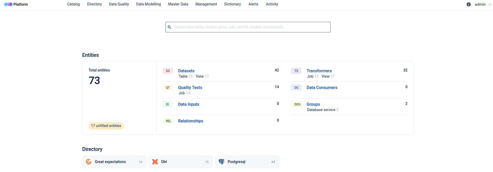

# Open Data Discovery

### What can you do with `ODD` 

- **Centralize and Organize All Data Assets** 
- **Ensure Data Quality and Consistency**
- **Improve Compliance and Data Governance**
- **Enhance Collaboration** 

### Centralize and Organize All Data Assets

{ width=120% }

### Ensure Data Quality and Consistency

{ width=120% }

### Improve Compliance and Data Governance

{ width=120% }

### Enhance Collaboration

{ width=120% }

### What works automatically now:

::: incremental

- Metadata is collected logged to ODD
- Tests are logged and alerts are sent if they fail
- The lineage of the data modelling is logged in ODD

:::

### What works manually now:

::: incremental

- Adding descriptions of the data entities
- Configuring new tests and collectors
- Adding owners, tags etc

:::

### Open Short term todos

::: incremental

- Set up with external URL
- Add to Fraaliance Platform login
- Add source company for every entity
- Add more data validation tests
- Add more entity types - e.g. Superset 

:::

### Long term goals

::: incremental

- Automate some of the manual tasks
- Integrate options for selling the data
- Integrate tracking of data growth/Other statistics
- Your ideas?
 

:::

### Links

- [odd documentation](https://docs.opendatadiscovery.org/)
- [Internal INT ODD URL](https://odd-fraalliance-platform.int.k8s.lsyesp.lhgroup.de)
- [Internal PROD ODD URL](https://odd-fraalliance-platform.prod.k8s.lsyesp.lhgroup.de)

