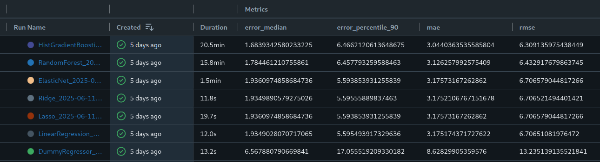

### Has Your Flight Ever Been Delayed?

{ width=60% }

**Annoying to pax, expensive for all!**

--- 

### ✈️ Why Planes Get Delayed

| Cause                  | Description                                 |
|------------------------|---------------------------------------------|
| 🚶 Passenger Flow       | Congestion at checkpoints |
| 🧳 Baggage Loading      | Slow or misplaced luggage                   |
| 🌧️ Weather              | Storms or low visibility     |
| ⛽ **Fueling Delays**   | *Common — but solvable!*       |

---

### 💸 Costs of Late Planes

::: incremental

- 27% of delays are due to baggage, boarding, apron (incl. fueling) issues
- €275 million in airline costs (fuel, crew delays, losses)
- €650 million in EU261 passenger compensation

- [Source: 2023 Eurocontrol Performance Review](https://www.eurocontrol.int/sites/default/files/2024-06/eurocontrol-performance-review-report-2023.pdf)

:::

---

### 🛢️ How Pilots Decide Fuel Quantity

| Factor                  | Impact                                         |
|--------------------------|------------------------------------------------|
| 🗺️ Route & Reserves       | Distance and more      |
| ⛽ FOB     | Current tank level               |
| ⚖️ Aircraft Weight | More weight = more drag    |
| 🇪🇺 EU Law (2024)        | Restrict excess tankering     |

---

### ⛽ Fueling Timeline: When Will It Be Done?

1. 🧑‍✈️ Pilot places fuel order (Uplift = Block Fuel – FOB)  
2. 🚛 Fueling starts — predict how long it will take
3. 🛫 Helps align catering, crew, and departure timing
4. ✅ Fueling ends → Aircraft ready to depart

**Knowing the fueling end time = fewer surprises & smoother handovers**

---

### 🔍 Modeling the Fueling duration

**Which features were relevant?**

::: incremental
- 🛩 Aircraft type captures weight, fuel tank size, engine count — all embedded in a single variable
- ⛽ Remaining uplift = Block Fuel – Fuel On Board → directly tied to fueling time
- ⏱ Minutes until takeoff encodes operational urgency: Time pressure, Likelihood of parallel fueling (more trucks dispatched), Typical ramp behavior
:::

---

### Model comparison

---

### Results per aircraft type

<iframe scrolling="no" style="border:none;" seamless="seamless" data-src="assets/absolute_error_quantiles.html" height="450" width="100%"></iframe>

---

### Message to Prediction Pipeline

::: incremental
- 📨 Queue receives messages
- 🧠 Parse messages into structured data
- 🗃️ Insert parsed messages into the database
- 🔁 Duplicate message for prediction route
- 🔍 Extract hashkey and message type
- ❓ Check message type
- 🧩 Join message with context
- 📤 Send features to Mlflow served model
- 📥 Receive predicted fueling duration
- 🧾 Concatenate prediction with original message 
- 🛠️ Update database row with prediction

:::

---

### What is this prediction even for?

    We asked: “What’s the real point of the prediction?”

    The answer: to improve visibility and coordination

    Before departure:
    🛫 Fueling must be done
    🍽 Catering must be finished
    👨‍✈️ Crew needs a clear status

    Simple monitoring → Smoother operations → Fewer delays

    Currently prediciton is made after fueling start message sent
---

### ✈️ Future Plans

- 🚀 Trigger fueling proactively using the prediction
- 🕓 Ensure fueling completes before planned takeoff 
- 🎯 Better ramp orchestration with fewer delays
  

---

### Completely Open Source Techstack

- 🧱 PostgreSQL – Raw flight & fueling data
- 🔁 Rahla – Event-driven flight data processor
- 🧠 SciKit Learn – model
- 🧪 MLflow – Model versioning / Serving
- ☸️ Kubernetes – Deployment platform
- 🔁 ArgoCD – Orchestration
- 🛠️ Theia – Continual development environment

---

### Some dT Projects in the airline industry

{ width=200px align=right }

- 🔁 Missed Connections
- 👥 Passenger Flow  
- 🛰️ Flight Positioning 
- ⛽ Fueling Duration 
- 💳 Fuel Purchase Forecasting

--- 

### Links

- [These sides](https://samueladamsmcguire.github.io)
- [My Github](https://github.com/samueladamsmcguire)
- [datatactics website](https://www.datatactics.de/)
- [datatactics LinkedIn](https://www.linkedin.com/company/datatactics-gmbh)

---

### Let's connect

{ width=60% }

