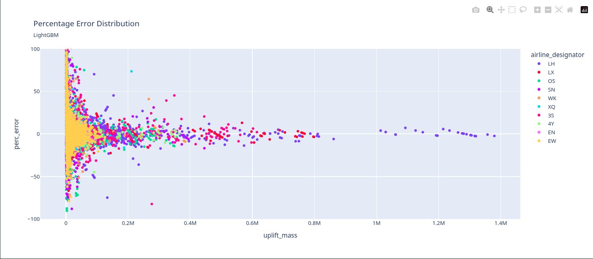

### Staus Quo 

The current tool assigns the average uplift from the last three full calendar months for the city pair and aircraft type to each event in the schedule and sums everything up.

---

### Goal: More efficient fuel Uplift forecast

Taking a different approach we will try to model the changes in the plan flight from schedule to actual in order to have a more precise flight plan that can be used to calculate the uplift needed.

<!--  -->
<!--  -->

---

### Assumptions

1. Using a seasonal avg of mins flown will be better than the scheduled min
2. Minutes flown and total departures have a direct relationship with uplift
3. Due to scheduling flux modeling schedule changes will lead to more accurate forecasts

---

### Problems that could hurt forecast

1. Uplift values to train model 2 can only be used from 2025 due to new tankering regulations 
2. Fueling is still adjusting to the tankering regulations
3. Anolomies such as weather events and econmic changes could affect the forecast

--- 

### Schedule behavior analysis

<iframe scrolling="no" style="border:none;" seamless="seamless" data-src="assets/schedule_change_analysis_by_airline_designator.html" height="450" width="100%"></iframe>

---

### Our Idea Model 1

::: incremental

- Scheduled and actual flight plan aree rarely the same
- Model difference between scheduled and actual flights
- Forecast: Number of departures and minutes flown

:::

---

### Model 1 input features

---

### Our Idea Model 2

::: incremental

- Use output of model 1 as input to predict total uplift
- Instead of using avg try other ML based models 
- Compare the results to status quo as well as actual burnoff

:::

---

### Model 2 input features

---

### Model 2 General results

--- 

### Model Flow Chart

---

### General Results Model 1

---

### General Results Model 2

<iframe scrolling="no" style="border:none;" seamless="seamless" data-src="assets/absolute_error_quantiles.html" height="450" width="100%"></iframe>

---

### Current Status

The model pipeline has been set. However the comparison with the actual uplift is still not matching up. 
We plan on improving model 1 while getting model 2 to a place where the uplift forecast is more accurate and eventually better than the status quo.

### Next Steps

- Model 2: get reasonable results from the forecast
- Model 1: improve, add more features such as enconmic impact, waeather and so on
- Set up in test environment for rigorous testing 
- comparing with current forecast and actual uplift

